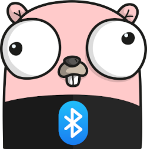

# Go Bluetooth

[](https://tinygo.org/bluetooth)

[](https://pkg.go.dev/tinygo.org/x/bluetooth)
[](https://circleci.com/gh/tinygo-org/bluetooth/tree/dev)

Go Bluetooth is a cross-platform package for using [Bluetooth Low Energy](https://en.wikipedia.org/wiki/Bluetooth_Low_Energy) hardware from the Go programming language. 

It works on typical operating systems such as [Linux](#linux), [macOS](#macos), and [Windows](#windows). 

It can also be used running "bare metal" on microcontrollers produced by [Nordic Semiconductor](https://www.nordicsemi.com/) by using [TinyGo](https://tinygo.org/).

The Go Bluetooth package can be used to create both Bluetooth Low Energy Centrals as well as to create Bluetooth Low Energy Peripherals.

## Bluetooth Low Energy Central

A typical Bluetooth Low Energy Central would be your laptop computer or mobile phone.

This example shows a central that scans for peripheral devices and then displays information about them as they are discovered:

```go
package main

import (
	"tinygo.org/x/bluetooth"
)

var adapter = bluetooth.DefaultAdapter

func main() {
	// Enable BLE interface.
	must("enable BLE stack", adapter.Enable())

	// Start scanning.
	println("scanning...")
	err := adapter.Scan(func(adapter *bluetooth.Adapter, device bluetooth.ScanResult) {
		println("found device:", device.Address.String(), device.RSSI, device.LocalName())
	})
	must("start scan", err)
}

func must(action string, err error) {
	if err != nil {
		panic("failed to " + action + ": " + err.Error())
	}
}
```

## Bluetooth Low Energy Peripheral

A typical Bluetooth Low Energy Peripheral would be a temperature sensor or heart rate sensor.

This example shows a peripheral that advertises itself as being available for connection:

```go
package main

import (
	"time"

	"tinygo.org/x/bluetooth"
)

var adapter = bluetooth.DefaultAdapter

func main() {
  	// Enable BLE interface.
	must("enable BLE stack", adapter.Enable())

  	// Define the peripheral device info.
	adv := adapter.DefaultAdvertisement()
	must("config adv", adv.Configure(bluetooth.AdvertisementOptions{
		LocalName: "Go Bluetooth",
  	}))
  
  	// Start advertising
	must("start adv", adv.Start())

	println("advertising...")
	for {
		// Sleep forever.
		time.Sleep(time.Hour)
	}
}

func must(action string, err error) {
	if err != nil {
		panic("failed to " + action + ": " + err.Error())
	}
}
```

## Current support

|                                  | Linux              | macOS              | Windows            | Nordic Semi        |
| -------------------------------- | ------------------ | ------------------ | ------------------ | ------------------ |
| API used                         | BlueZ              | CoreBluetooth      | WinRT              | SoftDevice         |
| Scanning                         | :heavy_check_mark: | :heavy_check_mark: | :heavy_check_mark: | :heavy_check_mark: |
| Connect to peripheral            | :heavy_check_mark: | :heavy_check_mark: | :x:                | :heavy_check_mark: |
| Write peripheral characteristics | :heavy_check_mark: | :heavy_check_mark: | :x:                | :heavy_check_mark: |
| Receive notifications            | :heavy_check_mark: | :heavy_check_mark: | :x:                | :heavy_check_mark: |
| Advertisement                    | :heavy_check_mark: | :x:                | :x:                | :heavy_check_mark: |
| Local services                   | :heavy_check_mark: | :x:                | :x:                | :heavy_check_mark: |
| Local characteristics            | :heavy_check_mark: | :x:                | :x:                | :heavy_check_mark: |
| Send notifications               | :heavy_check_mark: | :x:                | :x:                | :heavy_check_mark: |

## Linux

Go Bluetooth support for Linux uses [BlueZ](http://www.bluez.org/) via the [D-Bus](https://en.wikipedia.org/wiki/D-Bus) interface thanks to the https://github.com/muka/go-bluetooth package. This should work with most distros that support BlueZ such as Ubuntu, Debian, Fedora, and Arch Linux, among others. 

Linux can be used both as a BLE Central or as a BLE Peripheral.

### Installation

You need to have a fairly recent version of BlueZ, for example v5.48 is the latest released version for Ubuntu/Debian.

	sudo apt update
	sudo apt install bluez

Once you have done this, you can obtain the Go Bluetooth package using Git:

	git clone https://github.com/tinygo-org/bluetooth.git

### Compiling

After you have followed the installation, you should be able to compile/run the "scanner" test program:

	cd bluetooth
	go run ./examples/scanner

## macOS

Go Bluetooth support for macOS uses the [CoreBluetooth](https://developer.apple.com/documentation/corebluetooth?language=objc) libraries thanks to the https://github.com/JuulLabs-OSS/cbgo package. 

As a result, it should work with most versions of macOS, although it will require compiling using whatever specific version of XCode is required by your version of the operating system. 

The macOS support only can only act as a BLE Central at this time, with some additional development work needed for full functionality.

### Installation

In order to compile Go Bluetooth code targeting macOS, you must do so on macOS itself. In other words, we do not currently have cross compiler support. You must also have XCode tools installed:

	xcode-select --install

Once you have done this, you can obtain the Go Bluetooth package using Git:

	git clone https://github.com/tinygo-org/bluetooth.git

### Compiling

After you have followed the installation, you should be able to compile/run the "scanner" test program:

	cd bluetooth
	go run ./examples/scanner

## Windows

Go Bluetooth support for Windows uses the [WinRT Bluetooth](https://docs.microsoft.com/en-us/uwp/api/windows.devices.bluetooth.bluetoothadapter?view=winrt-19041) interfaces by way of the https://github.com/tinygo-org/bluetooth/winbt package that is part of this package.

The Windows support is still experimental, and needs additional development to be useful. At this time, it can only be used to perform scanning operations as a BLE Central.

For specifics please see https://github.com/tinygo-org/bluetooth/issues/13

### Installation

Once you have done this, you can obtain the Go Bluetooth package using Git:

	git clone https://github.com/tinygo-org/bluetooth.git

### Compiling

After you have followed the installation, you should be able to compile/run the "scanner" test program:

	cd bluetooth
	go run .\examples\scanner

## Nordic Semiconductor

Go Bluetooth has bare metal support for several chips from Nordic Semiconductor that include a built-in Bluetooth Low Energy radio. 

This support requires compiling your programs using [TinyGo](https://tinygo.org/).

You must also use firmware provided by Nordic Semiconductor known as the "SoftDevice". The SoftDevice is a binary blob that implements the BLE stack. There are other (open source) BLE stacks, but the SoftDevices are pretty solid and have all the qualifications you might need. Other BLE stacks might be added in the future.

The Nordic Semiconductor SoftDevice can be used both as a BLE Central or as a BLE Peripheral, depending on which chip is being used. See the "Supported Chips" section below.

### Installation

You must install TinyGo to be able to compile bare metal code using Go Bluetooth. Follow the instructions for your operating system at https://tinygo.org/getting-started/  

Once you have installed TinyGo, you can install the Go Bluetooth package by running:

	git clone https://github.com/tinygo-org/bluetooth.git

Check your desired target board for any additional installation requirements.

### Adafruit "Bluefruit" boards

The line of "Bluefruit" boards created by Adafruit already have the SoftDevice firmware pre-loaded. This means you can use TinyGo and the Go Bluetooth package without any additional steps required. Supported Adafruit boards include:

* [Adafruit Circuit Playground Bluefruit](https://www.adafruit.com/product/4333)
* [Adafruit CLUE Alpha](https://www.adafruit.com/product/4500)
* [Adafruit Feather nRF52840 Express](https://www.adafruit.com/product/4062)
* [Adafruit ItsyBitsy nRF52840](https://www.adafruit.com/product/4481)

After you have installed TinyGo and the Go Bluetooth package, you should be able to compile/run code for your device.

For example, this command can be used to compile and flash an Adafruit Circuit Playground Bluefruit board with the example we provide that turns it into a BLE server to control the built-in NeoPixel LEDs:

	tinygo flash -target circuitplay-bluefruit ./examples/circuitplay

There are other boards with TinyGo support that also use the same UF2 bootloader with pre-loaded SoftDevice. They include:

* [Nice Keyboards nice!nano](https://nicekeyboards.com/products/nice-nano-v1-0)
* [Makerdiary nRF52840 MDK USB Dongle](https://wiki.makerdiary.com/nrf52840-mdk-usb-dongle/)

### BBC micro:bit

#### Version 1

The [BBC micro:bit](https://microbit.org/) uses an nRF51 chip with a CMSIS-DAP interface.

You will need to install OpenOCD (http://openocd.org/) to flash the board.

First, flash the SoftDevice firmware by copying the .hex file to the device. For example (on Linux):

	cd bluetooth
    cp ./s110_nrf51_8.0.0/s110_nrf51_8.0.0_softdevice.hex /media/yourusername/MICROBIT/

Once you have copied the SoftDevice firmware to the BBC micro:bit, you can then flash your TinyGo program:

    tinygo flash -target=microbit-s110v8 ./examples/heartrate

#### Version 2

The [BBC micro:bit v2](https://microbit.org/new-microbit/) uses an nRF52833 chip with a CMSIS-DAP interface.

Support for the v2 will be available soon.

### Supported Chips

The following Nordic Semiconductor chips are currently supported:

* [nRF51822](https://www.nordicsemi.com/Products/Low-power-short-range-wireless/nRF51822) with the [S110](https://www.nordicsemi.com/Software-and-Tools/Software/S110) SoftDevice (version 8). This SoftDevice does not support all features (e.g. scanning).
* [nRF52832](https://www.nordicsemi.com/Products/Low-power-short-range-wireless/nRF52832) with the [S132](https://www.nordicsemi.com/Software-and-Tools/Software/S132) SoftDevice (version 6).
* [nRF52840](https://www.nordicsemi.com/Products/Low-power-short-range-wireless/nRF52840) with the [S140](https://www.nordicsemi.com/Software-and-Tools/Software/S140) SoftDevice (version 6 and 7).

### Flashing the SoftDevice on Other Boards

To use a board that uses one of the above supported chips from Nordic Semiconductor, other then those already listed, you will probably need to install the SoftDevice firmware on the board yourself in order to use it with TinyGo and the Go Bluetooth package.

Flashing the SoftDevice can sometimes be tricky. If you have [nrfjprog](https://www.nordicsemi.com/Software-and-Tools/Development-Tools/nRF-Command-Line-Tools) installed, you can erase the flash and flash the new BLE firmware using the following commands. Replace the path to the hex file with the correct SoftDevice, for example `s132_nrf52_6.1.1/s132_nrf52_6.1.1_softdevice.hex` for S132 version 6.

    nrfjprog -f nrf52 --eraseall
    nrfjprog -f nrf52 --program path/to/softdevice.hex

After that, don't reset the board but instead flash a new program to it. For example, you can flash the Heart Rate Sensor example using `tinygo` (modify the `-target` flag as needed for your board):

    tinygo flash -target=pca10040-s132v6 ./examples/heartrate

Flashing will normally reset the board.

## API stability

**The API is not stable!** Because many features are not yet implemented and some platforms (e.g. Windows and macOS) are not yet fully supported, it's hard to say what a good API will be. Therefore, if you want stability you should pick a particular git commit and use that. Go modules can be useful for this purpose.

Some things that will probably change:

  * Add options to the `Scan` method, for example to filter on UUID.
  * Extra options to the `Enable` function, to request particular features (such as the number of peripheral connections supported).

This package will probably remain unstable until the following has been implemented:

  * Scan filters. For example, to filter on service UUID.
  * Bonding and private addresses.
  * Full support for all features at least two desktop operating systems.
  * Maybe some Bluetooth Classic support, such as A2DP.

## Contributing

Your contributions are welcome!

Please take a look at our [CONTRIBUTING.md](./CONTRIBUTING.md) document for details.

## Frequently Asked Questions

**Q. Where can I get an introduction to Bluetooth Low Energy, GAP, GATT, etc.?**

A. Please see this excellent article from our friends at Adafruit: https://learn.adafruit.com/introduction-to-bluetooth-low-energy

**Q. What is a client and server in BLE?**

A. Please see https://devzone.nordicsemi.com/f/nordic-q-a/71/what-is-a-client-and-server-in-ble

**Q. Can a device be both a GATT client and GATT server?**

A. Yes, but this is not currently supported by Go Bluetooth. Current support is either to act as a central in client mode, or as a peripheral in server mode.

## License

This project is licensed under the BSD 3-clause license, see the LICENSE file for details.

The SoftDevices from Nordic are licensed under a different license, check the license file in the SoftDevice source directory.
