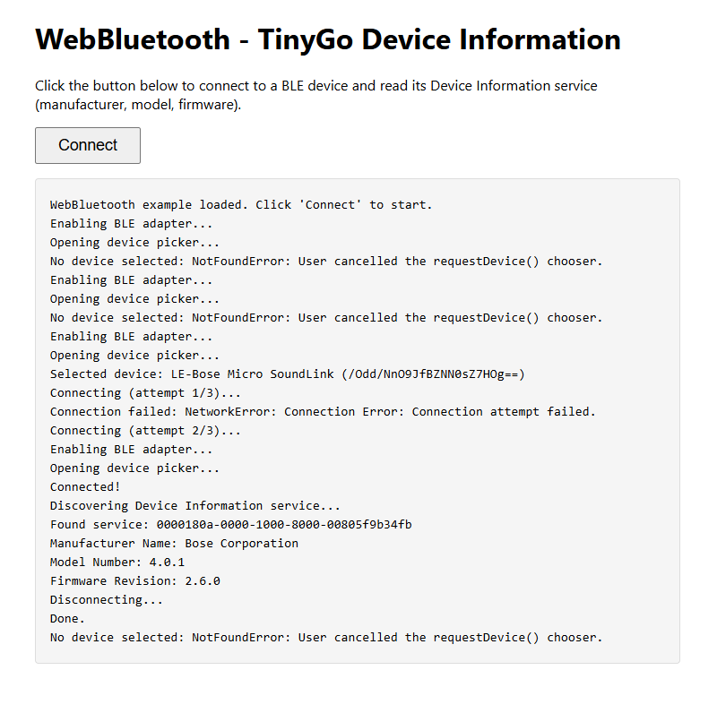

# WebBluetooth example

This example gives the WebBluetooth backend to a web page as a small JavaScript API. The page opens the device picker of the browser, reads the Device Information service of the device that you select, and can subscribe to a characteristic that sends notifications.

The WASM module only holds the binding. The page in `html/index.html` does all of the display work.



## Requirements

* [TinyGo](https://tinygo.org/getting-started/install/), or the standard Go toolchain.
* A browser with WebBluetooth support, such as Chrome or Edge. See the [browser compatibility table](https://developer.mozilla.org/en-US/docs/Web/API/Web_Bluetooth_API#browser_compatibility).

WebBluetooth is only available in a secure context. A page on `localhost` counts as secure, so you do not need HTTPS during development.

## Build and run

The page needs two build products in the `html` directory: the module `wasm.wasm`, and the JavaScript support file `wasm_exec.js`. TinyGo and the standard Go toolchain each have their own support file. Always take both products from the same toolchain.

Run all commands from the root of the repository.

### Build with TinyGo

```shell
cp "$(tinygo env TINYGOROOT)/targets/wasm_exec.js" ./examples/webbluetooth/html/
tinygo build -o ./examples/webbluetooth/html/wasm.wasm -target wasm ./examples/webbluetooth/
```

### Build with the standard Go toolchain

```shell
cp "$(go env GOROOT)/lib/wasm/wasm_exec.js" ./examples/webbluetooth/html/
GOOS=js GOARCH=wasm go build -o ./examples/webbluetooth/html/wasm.wasm ./examples/webbluetooth/
```

Go versions before 1.24 keep the support file in `misc/wasm/wasm_exec.js`.

### Windows

The TinyGo commands also work in PowerShell. The standard Go toolchain needs the two variables in the environment:

```powershell
$env:GOOS = "js"; $env:GOARCH = "wasm"
go build -o ./examples/webbluetooth/html/wasm.wasm ./examples/webbluetooth/
```

### Serve the page

```shell
go run ./examples/webbluetooth/server/
```

Open http://localhost:8080 and click **Connect**. The browser shows the device picker. Select a device to see the result in the page.

Both `wasm.wasm` and `wasm_exec.js` are build output, so git ignores them.

## JavaScript API

The module sets `globalThis.ble`, then calls `globalThis.onBleReady` if the page gives that function. Define `onBleReady` before you start the module.

Every function returns a Promise. A function that JavaScript calls must not block, because it holds the event loop until it returns, and each call into the Bluetooth package waits for a promise.

| Function | Result |
| --- | --- |
| `ble.enable()` | Prepares the adapter. |
| `ble.requestDevice(serviceUUIDs)` | Opens the device picker. Gives `{id, name}` for the device that the user selects. |
| `ble.connect(id)` | Connects to the device with that id. |
| `ble.disconnect()` | Closes the connection. |
| `ble.read(service, characteristic)` | Gives the value as a `Uint8Array`. |
| `ble.readString(service, characteristic)` | Gives the value as a string. |
| `ble.subscribe(service, characteristic, callback)` | Starts notifications. Calls the callback with a `Uint8Array` for each new value. |
| `ble.unsubscribe(service, characteristic)` | Stops notifications. |
| `ble.onConnectionChange(callback)` | Calls the callback with a boolean on each connection and disconnection. Call it before `connect`. |

Give every service that the page uses to `requestDevice`. The browser refuses access to a service that the page did not ask for.

```js
globalThis.onBleReady = async () => {
	await ble.enable();
	const device = await ble.requestDevice(["0000180a-0000-1000-8000-00805f9b34fb"]);
	await ble.connect(device.id);
	console.log(await ble.readString(
		"0000180a-0000-1000-8000-00805f9b34fb",
		"00002a29-0000-1000-8000-00805f9b34fb"));
};
```

## Limitations of WebBluetooth

* The browser gives an opaque device ID instead of a MAC address. The `Address` type holds this ID.
* You must call `Scan` before `Connect`. The browser object for the device does not survive a page reload.
* You must list every service that you want to use in `Adapter.RequestedServices` before you call `Scan`. The browser refuses access to a service that is not in the list.
* The browser does not report the RSSI of the selected device.
* The browser does not give the negotiated MTU. `GetMTU` returns 512.
* WebBluetooth has no peripheral role, so advertisement and local services are not available.
